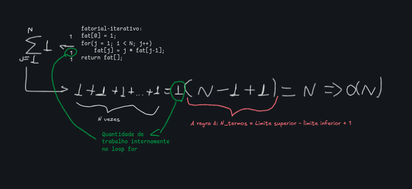
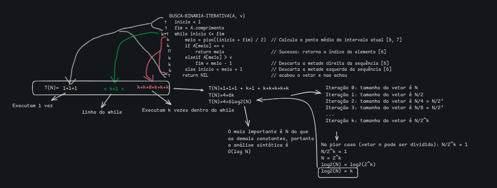

# Análise de Algoritmos Iterativos — Resumo de Estudos

---

## 1. Algoritmo do Fatorial (Laço Incremental)

### Código e Somatório

$$\sum_{j=1}^{N} 1 = 1 + 1 + 1 + \dots + 1 = 1 \cdot (N - 1 + 1) = N \Rightarrow O(N)$$

### Conceitos-Chave
* **Origem da Fórmula Fechada $(N - 1 + 1)$:**
  Fórmula geral para contar o número de elementos num intervalo consecutivo de $a$ até $b$:
  $$\text{Número de termos} = \text{limite\_superior} - \text{limite\_inferior} + 1 = (b - a + 1)$$
* **O fator multiplicativo $1$:**
  Representa o **trabalho constante** por iteração (custo das instruções internas do laço).

---

## 2. Busca Binária Iterativa (Laço por Divisão)

### Código e Dedução do Tempo

### Passo 1: Contagem de Linhas e Constantes
Somando o custo individual de cada linha em função do número de iterações $k$:

$$T(N) = \underbrace{(1 + 1 + 1)}_{\text{Linhas de fora}} + \underbrace{(k + 1)}_{\text{Verificação do while}} + \underbrace{(k + k + 0 + k + k + k)}_{\text{Instruções internas}}$$

$$T(N) = 4 + 6k$$

* **$C_{\text{fora}} = 4$:** Inicializações, retorno e teste falso final do `while`.
* **$C_{\text{dentro}} = 6$:** Instruções executadas nas $k$ iterações.

---

### Passo 2: Dedução do valor de $k$ em função de $N$
Como o espaço de busca reduz pela metade a cada iteração:

* **Iteração 0:** Tamanho $= N$
* **Iteração 1:** Tamanho $= N/2$
* **Iteração 2:** Tamanho $= N/2^2$
* **Iteração $k$:** Tamanho $= N/2^k$

No pior caso, o algoritmo para quando o intervalo não pode mais ser dividido (tamanho $1$):

$$\frac{N}{2^k} = 1 \implies N = 2^k \implies \log_2(N) = k$$

---

### Passo 3: Substituição e Notação Assintótica

$$T(N) = 4 + 6\log_2(N)$$

Como o termo dominante para crescimentos grandes é $\log_2(N)$, descartamos as constantes aditivas e multiplicativas:

$$T(N) \implies O(\log N)$$